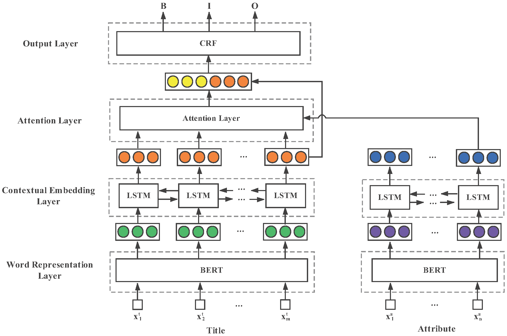

# Scaling Up Open Tagging from Tens to Thousands: Comprehension Empowered Attribute Value Extraction from Product Title 
This repo contains a subset of the dataset used in ACL2019 research paper ["Scaling Up Open Tagging from Tens to Thousands: Comprehension Empowered Attribute Value Extraction from Product Title"](url).

We release this dataset only for acdemic research use. Please cite our paper if you use this dataset in research. For any questions, please contact Prof. Lan at `mlan@cs.ecnu.edu.cn`. 


## Problem Statement
Given an e-commerce product title and a specific attribute, the goal is to extract the corresponding attribute value. For example,  

* Product Title: 2019 Summer Women Button Decorated Print Dress Off-shoulder Party Beach Sundress Boho Spaghetti Long Dresses Plus Size FICUSRONG.
* Attribute: Season
* Value: Summer


## Model Overview



## Dataset Description
We collect product information from AliExpress Sports & Entertainment category. Then compare each attribute value in "Item Specific" against the product title using exact string match to generate positive triples `<title, attribute, value>`. Negative triples `<title, attribute, NULL>` are randomly generated. Each triple is stored in a line and separated by `\u0001`. 

Due to copyright issue, we only release a subset of our collected dataset. This published subset contains 52,703 products, 2,761 attributes and 110,484 triples. The distribution of attribute frequency in this subset is listed below, which is consistent to the distribution of attribute frequency in full dataset.

| Groups | Occurrence | # of Attributes |
| :------| ------: | ------: |
| High | [1000,+∞) | 13 |
| Medium | [100,1000) | 49 |
| Low | [10,100) | 208 |
| Rare | [1,10) | 2491 |
| Total | - | 2761 |

Please also note that products listed in this subset may not still be sold on AliExpress anymore.


## Experiment Result on This Dataset
To ease any future comparison to our proposed model, we further report our experiment results on this published dataset.
The performance of our model trained on paper's dataset and tested on this subset is listed below, which is close to the performances reported in our paper.

| Attributes | Precision(%) | Recall(%) | F1(%) |
| :------| ------: | ------: | ------: |
| ALL | 86.83 | 76.88 | 81.55 |
| Brand Name | 95.44 | 94.90 | 95.17 |
| Material | 81.96 | 80.29 | 81.12 |
| Color | 73.29 | 66.40 | 69.28 |
| Category | 86.17 | 78.07 | 81.92 |


The performance of our model both trained and tested on this subset (i.e., 80%:20% split) is listed below. Compare to the paper, we observe a noticable performance drop, but we believe this is due to the much smaller size of training data.

| Attributes | Precision(%) | Recall(%) | F1(%) |
| :------| ------: | ------: | ------: |
| ALL | 79.85 | 70.57 | 74.92 |
| Brand Name | 91.19 | 91.57 | 91.38 |
| Material | 74.07 | 63.86 | 68.59 |
| Color | 57.58 | 48.72 | 52.78 |
| Category | 62.03 | 51.58 | 56.32 |


## Citation
If you use this dataset in your research, please cite our paper as follows:

```
@inproceedings{huimin2019scaling,
  title={Scaling Up Open Tagging from Tens to Thousands: Comprehension Empowered Attribute Value Extraction from Product Title},
  author={Huimin Xu, Wenting Wang, Xin Mao, Xinyu Jiang and Man Lan},
  booktitle={Proceedings of ACL},
  year={2019}
}
```

